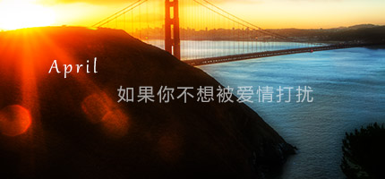

 时光如梭，转眼就是一个多月过去了 ，可惜的是，她还是她，我还是我，已经没有任何交集了。 遇见一些人，离去一些人，淡忘一些人。时间它真是个无情的东西，会让人变得麻木，变得茫然，变得冷漠，把一切都洗浴得面目全非，回不到初时的模样，把鲜艳的变灰暗，把热情的变冷淡。 当爱情经过，我认为这是上帝给人最美好的礼物。我没有去抗拒，所以，她很自己的发生了。也许是我太过热情，使得她有些手足无措；也许是她并不期待，以至于到处闪躲；也许我并不是她等待的那个人，甚至是厌恶我和她说的每一句话。我就像一个小丑，孤独的站在舞台上面，自言自语，演绎着人生中的一场默剧。 我并不了解她，就像她不了解我一样。我总是试图找到能和她对话的频率。可以让我了解她多一点，但每次一打开话题，能说得却寥寥无几。我并不是一个善解人意的人。记得从哪里看到了这句话：如果你不爱一个人，请放手，好让别人有机会爱她：如果你爱的人并不爱你，请放开自己，好让自己有机会爱别人。这话直白但很有道理，也从侧面教会了人们如何对待情感。 人生中也许会经历许多种爱，但千万不要让爱成为一种伤害。生活中到处都存在缘分，缘聚缘散好像都是命中注定的事情。有些缘分一开始就注定的事情。有些缘分一开始就注定要失去，有些缘分是永远都不会有好结果。我却偏偏渴望创造一种奇迹。爱一个人不一定要拥有，但拥有一个人就一定要好好的去爱她。 如果注定是失去，你怕不怕付出？当然怕，盲目的付出更是不会有结果。我想放弃，但是却又不甘心就此陌路。每当我打开QQ，看着好友面板，不经意的找到她的头像，我在想，她会不会突然跟我打个招呼？可惜并没有，我就像一个陌生人，安静的躺在她的好友列表里。多次想给她发个消息。但一想起她的只言片语，瞬间就没了勇气。 今天是哥哥（张国荣）的忌日，整个世界充满了灰色，让人特别容易伤感。最喜欢他那句“我就是我，是颜色不一样的烟火”。我很想问问她，你是什么样的烟火呢？