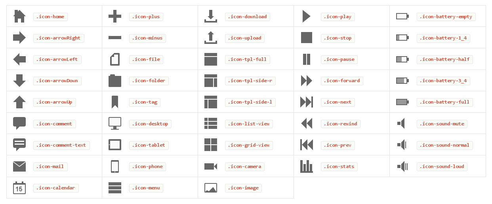

#### 什么是CIKONSS？

**Cikonss**是利用纯CSS技术构建的响应式、跨浏览器的icon。所说的“跨浏览器”是指IE8+。这意味着必须使用CSS2，因此，可以绘制的形状或图形就受到了限制。 某些icon必须有 border-radius 属性，这主要是为了在支持此属性的浏览器上更好的绘制icon，而且不会影响到不支持此属性的浏览器。 cikonss共有43个icon，5种尺寸、3种样式。每个icon都是由两个  元素构成。   

#### 如何使用

在html文件的head标签内容引入 cikonss.css 文件，如下：

比如我需要一个邮件的图标

具体效果如下：

> 传送地址：[http://cikonss.zzapwebdesign.com](http://cikonss.zzapwebdesign.com)