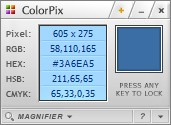
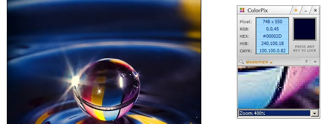

第一次看到它，就被它那灰色质感的外观给折服了。没错，就是它了——ColorPix    非常小巧NICE的界面，支持置顶，按任意键就可以锁定颜色。Ctrl+C复制锁定的颜色。   

Ctrl+M打开放大镜，更精准的找到你需要的颜色！最大可以放大到28倍，还有什么颜色是不能取到呢？

#### 下载地址

[百度网盘下载](http://pan.baidu.com/share/link?shareid=471462&uk=1796312283 "百度网盘下载")(压缩包密码：vsnote.test)