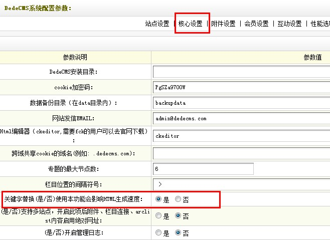
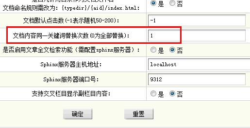
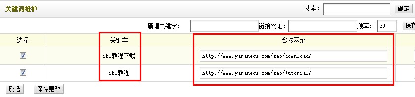
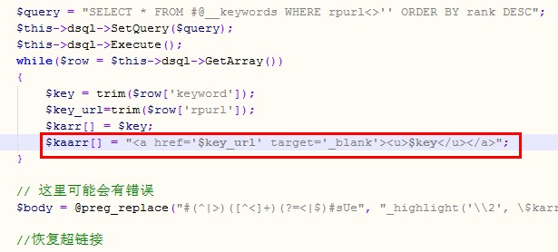

#### 首先让我们来看看内链的作用

在SEO界盛行着“小站靠外链，大站靠内链”这种说法，内链地合理安排，是我们做站内优化的一个重要手段。合理的内链分布，不仅仅有利于提高搜索引擎对网站的爬行效率，更有利于网站的收录。一个页面要被收录，首先要能够被搜索引擎的蜘蛛爬行到，蜘蛛的爬行轨迹是顺着一个链接到另一个链接，想让搜索引擎蜘蛛更好地爬行，一般都需要通过反向链接来引导，但是内页的爬行就需要良好的内部链接了，如果不注意形成死链、断链，蜘蛛就无从爬起，也就谈不上良好收录了。

#### 织梦自动加内链的实现方法

1. 在织梦后台 -> 系统 -> 系统基本参数 -> 核心设置 -> 关键字替换（是/否），这里选择“是”，如下图所示： 
2. 后台 -> 系统 -> 系统基本参数 -> 其他选项 -> 文档内容同一关键词替换次数(0为全部替换)，设置为1，同一个关键词内链只有一个投票权，设置多了没作用，反而加重了蜘蛛的爬行负担，如下图所示： 
3. 后台 -> 核心 -> 批量维护 -> 文档关键词维护, 在这里面设置关键词以及指向网址的链接，也可以手动添加自己需要的关键词和链接，如下图所示： 
4. 进一步优化。修改源文件： `include/arc.archives.class.php` ，给这个超链接加了一个`<u>`的标签，如下图，其实我们可以给它改为`<strong>`，关且给关键词加上比较醒目的红色，方便阅读者区分。  修改之前的代码：

```php
$kaarr[] = "[$key]($key_url)";
```

修改之后的代码：

```php
$kaarr[] = "[**$key**]($key_url)";
```
