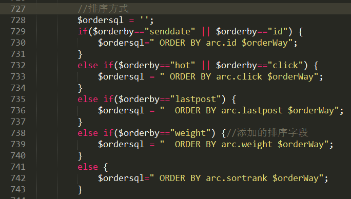
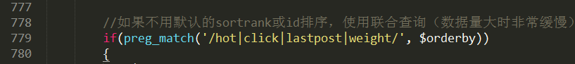
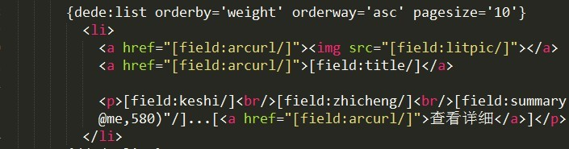

织梦文章列表页默认是不支持weight权重排序的。但是我们可以通过修改标签文件来实现这个方法。 打开根目录/include/arc.listview.class.php这个文件。    在727行这个组判断的任意位置加上一个weight字段排序的判断。 //排序方式 $ordersql = ''; if($orderby=="senddate" $orderby=="id") { $ordersql=" ORDER BY arc.id $orderWay"; } else if($orderby=="hot" $orderby=="click") { $ordersql = " ORDER BY arc.click $orderWay"; } else if($orderby=="lastpost") { $ordersql = " ORDER BY arc.lastpost $orderWay"; } else if($orderby=="weight") {//添加的排序字段  $ordersql = " ORDER BY arc.weight $orderWay";  } else { $ordersql=" ORDER BY arc.sortrank $orderWay"; } 懒一点的话可以直接复制上面的代码再改下字段名就行了。  然后在779行加上weight字段：if(preg\_match('/hotclicklastpostweight/', $orderby)) 最后在list模板文件里面加上    {dede:list orderby='weight' orderway='asc' pagesize='10'} <li>  <a href="\[field:arcurl/\]">\[field:title/\]</a> 
\[field:keshi/\] \[field:zhicheng/\] \[field:summary function="cn\_substr(@me,580)"/\]...\[<a href="\[field:arcurl/\]">查看详细</a>\]
 </li> {/dede:list} 红色部分是添加的代码。