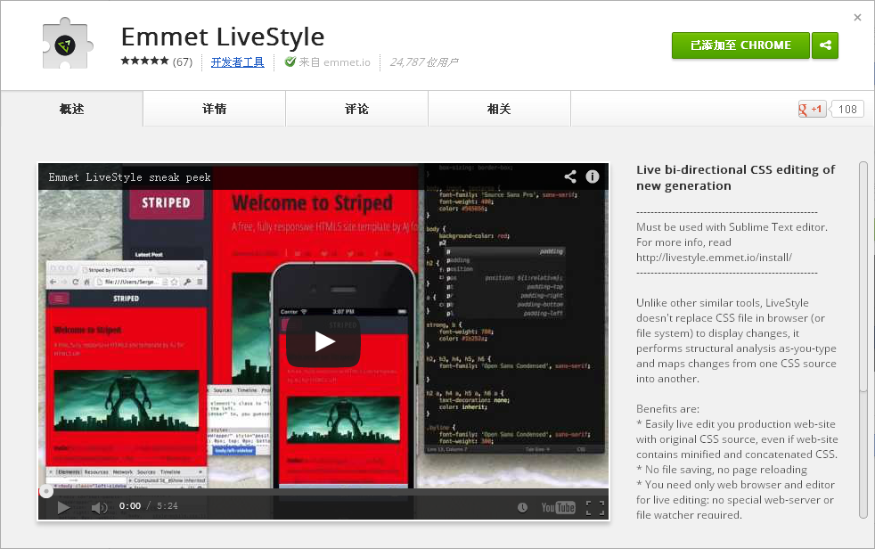
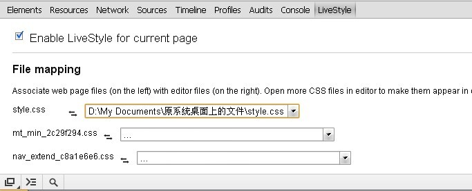

Emmet LiveStyle 是一个配合 Sublime text 使用的谷歌浏览器插件，它是一个可以实现 \[编辑器↔浏览器\] 实时双向预览编辑的新一代 CSS 编辑器，目前只能够在 Chrome 和 Sublime Text 使用，以后应该会支持更多的浏览器跟编辑器的。

#### LiveStyle 功能

*   即时更新：马上看到你修改的样式。 不需要反复保存文件，也不需要刷新浏览器。
*   不是本地文件也可以编辑。
*   跨平台
*   多视图和多设备更新。 你可以在不同的窗口中打开相同的页面，并让所有的窗口即时更新。 用它，你可以轻松地在大屏显视器上调整响应式设计，因为它支持不同设备上实时无刷新预览！
*   多站点更新。 你甚至可以在线编辑不同的Web站点，例如，台式机和移动版本的网站，共享相同的CSS代码库。
*   非常容易安装：只需打开编辑器中的CSS文件，在浏览器中安装LiveStyle插件就行了。

#### 在 Chrome 中安装 LiveStyle 插件

在 Chrome 应用商店搜索 LiveStyle 或者直接打开[https://chrome.google.com/webstore/detail/emmet-livestyle/diebikgmpmeppiilkaijjbdgciafajmg?utm\_source=chrome-ntp-icon](https://chrome.google.com/webstore/detail/emmet-livestyle/diebikgmpmeppiilkaijjbdgciafajmg?utm_source=chrome-ntp-icon)，安装完后重启浏览器。  再打开时，按F12打开开发者工具你会发现多了一个 LiveStyle 的选项卡：    当然，这个是需要在 Sublime Text 里面安装 LiveStyle 这个插件才能启用的。

#### 在Sublime Text 编辑器里面安装 LiveStyle 插件

要在 Sublime Text 里面安装插件，你肯定需要这个 [Package Control](http://vsnote.test/sublime-text-3047-plus.html "sublime text 3047(dev版本) 插件控制器下载")，有它在，安装插件就将变得非常方便。 安装 Package Control 后你只需要按 Crtl+Shift+p 输入 packi 回车搜索 LiveStyle 就能快捷的安装这个插件了。 一切就绪后，快去享受高效的实时CSS编辑的快感吧！

#### 相关下载

[Sublime Text 3 中文破解版](http://pan.baidu.com/s/1sYT3p)