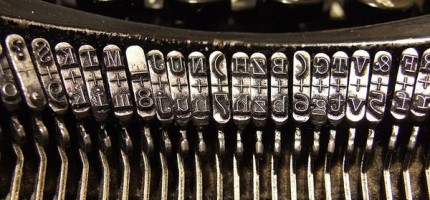

#### 键盘快捷键

F1帮助 F2改名 F3搜索 F4地址 F5刷新 F6切换 F10菜单 CTRL+A全选 CTRL+C复制 CTRL+X剪切 CTRL+V粘贴 CTRL+Z撤消 CTRL+O打开 SHIFT+DELETE永久删除 DELETE删除 ALT+ENTER属性 ALT+F4关闭 CTRL+F4关闭 ALT+TAB切换 ALT+ESC切换 ALT+空格键窗口菜单 CTRL+ESC开始菜单 拖动某一项时按CTRL复制所选项目 拖动某一项时按CTRL+SHIFT创建快捷方式 将光盘插入到CD-ROM驱动器时按SHIFT键阻止光盘自动播放 Ctrl+1,2,3… 切换到从左边数起第1,2,3…个标签 Ctrl+A 全部选中当前页面内容 Ctrl+C 复制当前选中内容 Ctrl+D 打开“添加收藏”面版(把当前页面添加到收藏夹中) Ctrl+E 打开或关闭“搜索”侧边栏(各种搜索引擎可选) Ctrl+F 打开“查找”面版 Ctrl+G 打开或关闭“简易收集”面板 Ctrl+H 打开“历史”侧边栏 Ctrl+I 打开“收藏夹”侧边栏/另:将所有垂直平铺或水平平铺或层叠的窗口恢复 Ctrl+K 关闭除当前和锁定标签外的所有标签 Ctrl+L 打开“打开”面版(可以在当前页面打开Iternet地址或其他文件…) Ctrl+N 新建一个空白窗口(可更改,Maxthon选项→标签→新建) Ctrl+O 打开“打开”面版(可以在当前页面打开Iternet地址或其他文件…) Ctrl+P 打开“打印”面板(可以打印网页,图片什么的…) Ctrl+Q 打开“添加到过滤列表”面板(将当前页面地址发送到过滤列表) Ctrl+R 刷新当前页面 Ctrl+S 打开“保存网页”面板(可以将当前页面所有内容保存下来) Ctrl+T 垂直平铺所有窗口 Ctrl+V 粘贴当前剪贴板内的内容 Ctrl+W 关闭当前标签(窗口) Ctrl+X 剪切当前选中内容(一般只用于文本操作) Ctrl+Y 重做刚才动作(一般只用于文本操作) Ctrl+Z 撤消刚才动作(一般只用于文本操作) Ctrl+F4 关闭当前标签(窗口) Ctrl+F5 刷新当前页面 Ctrl+F6 按页面打开的先后时间顺序向前切换标签(窗口) Ctrl+F11 隐藏或显示菜单栏 Ctrl+Tab 以小菜单方式向下切换标签(窗口) Ctrl+Enter 域名自动完成http://www.XXX.com(内容可更改,Maxthon选项→地址栏→常规)/另:当输入焦点在搜索栏中时,为高亮关键字 Ctrl+拖曳 保存该链接的地址或已选中的文本或指定的图片到一个文件夹中(保存目录可更改,Maxthon选项→保存) Ctrl+小键盘’+’ 当前页面放大20% Ctrl+小键盘’-’ 当前页面缩小20% Ctrl+小键盘’\*’ 恢复当前页面的缩放为原始大小 Ctrl+Alt+S 自动保存当前页面所有内容到指定文件夹(保存路径可更改,Maxthon选项→保存) Ctrl+Shift+小键盘’+’ 所有页面放大20% Ctrl+Shift+小键盘’-’ 所有页面缩小20% Ctrl+Shift+F 输入焦点移到搜索栏 Ctrl+Shift+G 关闭“简易收集”面板 Ctrl+Shift+H 打开并激活到你设置的主页 Ctrl+Shift+N 在新窗口中打开剪贴板中的地址,如果剪贴板中为文字,则调用搜索引擎搜索该文字(搜索引擎可选择,Maxthon选项→搜索) Ctrl+Shift+S 打开“保存网页”面板(可以将当前页面所有内容保存下来,等同于Ctrl+S) Ctrl+Shift+W 关闭除锁定标签外的全部标签(窗口) Ctrl+Shift+F6 按页面打开的先后时间顺序向后切换标签(窗口) Ctrl+Shift+Tab 以小菜单方式向上切换标签(窗口) Ctrl+Shift+Enter 域名自动完成http://www.XXX.com.cn(内容可更改,Maxthon选项→地址栏→常规) Alt+1 保存当前表单 Alt+2 保存为通用表单 Alt+A 展开收藏夹列表

#### 资源管理器

END显示当前窗口的底端 HOME显示当前窗口的顶端 NUMLOCK+数字键盘的减号(-)折叠所选的文件夹 NUMLOCK+数字键盘的加号(+)显示所选文件夹的内容 NUMLOCK+数字键盘的星号(\*)显示所选文件夹的所有子文件夹 向左键当前所选项处于展开状态时折叠该项，或选定其父文件夹 向右键当前所选项处于折叠状态时展开该项，或选定第一个子文件夹

#### 自然键盘

【窗口】显示或隐藏“开始”菜单 【窗口】+F1帮助 【窗口】+D显示桌面 【窗口】+R打开“运行” 【窗口】+E打开“我的电脑” 【窗口】+F搜索文件或文件夹 【窗口】+U打开“工具管理器” 【窗口】+BREAK显示“系统属性” 【窗口】+TAB在打开的项目之间切换 PS：如果怕忘记可以放在图片上，做为电脑桌面。