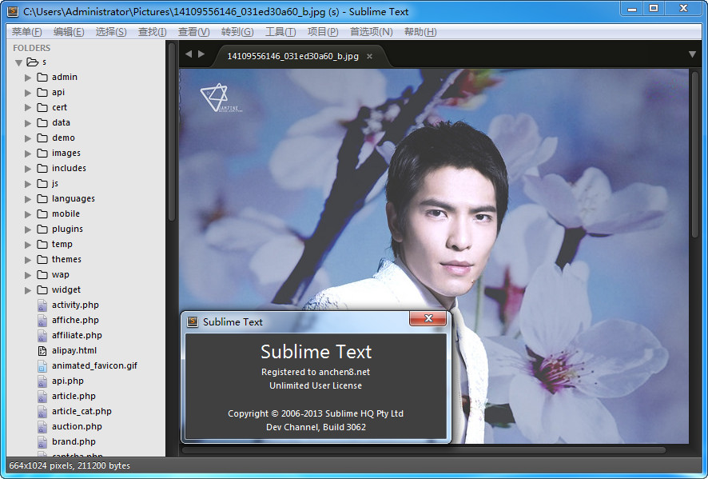

Sublime text 3 开发版3062更新。最直观的变化就是侧边栏添加了小图标，速度上也更快了，还有个就是图片也能在编辑器里预览（好像之前的版本也可以）。以前在编辑器里不小心点到图片的时候会很尴尬，看到的不是图片，而是一大串字符。这很显然是个很人性化的改变。

#### 功能更新

*   侧边栏添加文件/文件夹图标
*   侧边栏加载提示
*   记住侧边栏文件树展开路径
*   Fixed a crash in plugin\_host

#### 软件截图

#### 插件列表

*   Emmet
*   Git
*   jQuery
*   LiveStyle
*   nginx
*   Tag
*   sublimeTMPL
*   SFTP
*   ……

#### 下载地址

[Windows 32位版本](http://pan.baidu.com/s/1hqkjFLE) [Windwos 64位版本](http://pan.baidu.com/s/1eQ24AiQ) [Linux 32位版本](http://pan.baidu.com/s/1pJNQYCV) [Linux 64位版本](http://pan.baidu.com/s/13YKwe)