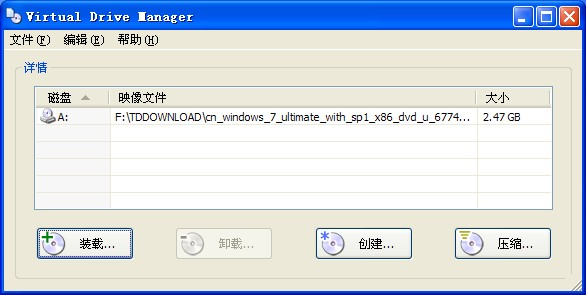

如果你是经常折腾系统的么，那么，肯定会需要这样一个小巧绿色的虚拟光驱！**Virtual Drive Manager**(vdm)  在 PE 系统里面也可以直接使用，支持 .iso、.img、.bin 等常见的镜像文件。   

#### 下载地址

[百度网盘下载](http://pan.baidu.com/share/link?shareid=487797&uk=1796312283 "Virtual Drive Manager 虚拟光驱下载")