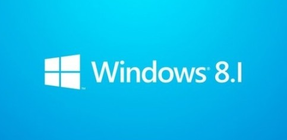

最近关于 Window8.1 RTM 的消息挺多的，相信很多人跟我一样都期待着 Windows 8.1 RTM 专业版的泄露。在今天终于等到了 Windows 8.1 RTM 简体中文版本！这个版本其实算是Windows 8 的完善版吧，大的改动没有，很多细节方面针对中国用户做出了妥协。也不再固执的把用户绑在开始界面上了，赶紧下来体验一下！

## Windows 8.1 RTM 文件信息

> [Win8.1 Core & Pro x64]
> FILE: 9600.16384.130821-1623_x64fre_Client_ZH-CN-IRM_CCSA_DV5.ISO
> SIZE: 4,076,017,664 byte
> SHA-1: F79E0093DDEDD488F40D4AE6B6F0FA3C529051E1
> MD5: BCB0FA9947C0F0E5E57F3A83EC7171D7
> Install Key: 334NH-RXG76-64THK-C7CKG-D3VPT(Core) XHQ8N-C3MCJ-RQXB6-WCHYG-C9WKB(Pro)

> [Win8.1 Ent x86]
> FILE: Windows_8.1_Ent_ZH-CN_Vl_x86.ISO
> SIZE: 2,968,020,992 byte
> SHA-1: CB1BAA1B477DB128117CF9633D60C8518B2A60E5
> MD5: 0DEA6E3C17662484DC0F47DED9B1022C

> [Win8.1 Ent x64]
> FILE: Windows_8.1_Ent_ZH-CN_Vl_x64.ISO
> SIZE: 3,973,625,856 byte
> SHA-1: 665F4830BB7D377EBF7DE5C8C411A769350ED454
> MD5: 6B5773E55DD915B65D3121166483404E

## 如何安装和使用零售密钥激活Windows 8.1 专业版

1. 下载windows 8.1 Pro ISO镜像
2. 刻录ISO光盘或使用“UltraISO软碟通”等软件创建一个启动U盘进行安装
3. 将刻录的 ISO 光盘或启动 U 盘插入电脑
4. 引导 DVD 光盘/启动U盘进入 WinPE 进行系统的安装
5. 安装时根据自己的系统版本输入密钥（请勿输入你自己的密钥）
   Windows 8.1 核心版 `334NH-RXG76-64THK-C7CKG-D3VPT`
   Windows 8.1 专业版 `XHQ8N-C3MCJ-RQXB6-WCHYG-C9WKB`
6. 当系统安装完成回到桌面时你会发现系统没有激活；右键单击左下角的“开始”按钮，选择“命令提示符（管理员）”选项
7. 将你的 WiFi/路由器/所有网络断开，然后输入 `slmgr.vbs -XXXXX-XXXXX-XXXXX-XXXXX-XXXXX`（更换正确的秘钥）
8. 更换成功后，在命令提示符窗口输入 SLUI 4 按回车
9. 点击“通过电话进行激活”
10. 选择“英国”
11. 使用 Skype 免费拨打激活窗口上面的电话号码
12. 拨打成功提示你选择按键的时候按1键
13. 然后输入你窗口上面 A-H 机器码
14. 当被问及有多少台电脑安装的时候按 1 键
15. 然后仔细聆听并记下所报数字并输入至激活窗口
16. 输入完成后单击“激活”窗口
17. 重新启动计算机激活完成

如何添加 Windows Media Center 的 Windows 8.1专业版

1. 激活激活Windows 8.1 Pro含WMC
2. 进入控制面板 -> 系统和安全 -> 系统，点击获取更多的功能，添加 Windows Media Center
3. 单击“我已经有一个产品密钥” 
4. 输入你以前 Windows 8 免费获取的WMC产品密钥
5. 勾选接受许可条款
6. Windows 会包括 WMC 功能，将自动重新启动
7. 重新启动 Windows 后，如果你的 Windows 没有被激活，则需要重新输入密钥一次，然后你会看到你的 Windows 8 Pro 与 WMC 将被激活（这通常是由于你的硬件变化，你需要重新输入 WMC 键后重新启动 Windows） 
8. 进入控制面板 -> 系统和安全 -> 系统，点击激活 [在线激活]
9. 联网激活后，恭喜你永久获得了 Windows 8 Pro 与 WMC，马上享用吧

## Windows 8 PRO/ENT离线激活 [MAK] 秘钥

```bat
slmgr.vbs -ipk 63VNX-R64MK-28K4H-Y6K4T-YG67C 
slmgr.vbs -ipk JXNBF-VG8TP-PBDBW-TB2K2-P9T7C 
slmgr.vbs -ipk 3XKNP-T864P-3WDQQ-H9FF3-2WCK2 
slmgr.vbs -ipk N9MRJ-6JRM9-M6XJC-6D6JD-QRPK2 
slmgr.vbs -ipk 73KKN-DHK63-WMGY2-6MC68-JFDHC 
slmgr.vbs -ipk NGKGG-W2V3K-G9X9Q-M7TXB-KD4DP 
slmgr.vbs -ipk J68BC-XTNWY-M3XQP-8TTR4-8B2K2 
slmgr.vbs -ipk HX388-XXNXX-WGWTG-KYTH8-RX492 
slmgr.vbs -ipk NY4RW-GMCHB-D3P9F-RJDP9-YDR92 
slmgr.vbs -ipk 3NKP9-K2XW9-FQHWH-MDMCQ-TCKVC 
slmgr.vbs -ipk 6CNK2-RTVRV-TXYQK-86DBM-B4DHC 
slmgr.vbs -ipk F2V7V-8WN76-77BPV-MKY36-MKH3P 
slmgr.vbs -ipk MR2WF-NWPQ9-WCRWV-6GVFR-HQR92 
slmgr.vbs -ipk BNYHR-XDRK6-HV96V-CFRJ9-H49VC 
slmgr.vbs -ipk MWNDT-WDBDY-TCJFF-KCK2V-4CWX2 
slmgr.vbs -ipk Y7NHY-DRGCX-KHWM2-P2DPY-YWMQP 
slmgr.vbs -ipk CYM8B-NH6WD-DJ7Q9-TYXJP-P9T7C 
slmgr.vbs -ipk 82WNH-WWCBT-Y843F-F7F7X-M9492 
slmgr.vbs -ipk RQGQD-DQNGY-TQHDF-CB2YR-WFDHC 
slmgr.vbs -ipk N3BDF-YMFJ3-P4VKX-C88VY-YWMQP 
slmgr.vbs -ipk 2C9ND-V2GFR-RR4YD-QB4DR-JHRDP 
slmgr.vbs -ipk MQJNQ-G2TKM-YJP7W-CCXVY-VQR92 
slmgr.vbs -ipk YT4KP-4TNXX-9MKRP-BYJC9-JW8X2 
slmgr.vbs -ipk Q74NW-797VJ-G8QM6-MYXDP-VFPK2
```

## Windows 8.1 & Windows 8 Pro / Pro WMC 离线激活零售版秘钥:

```bat
slmgr.vbs -ipk CGWVF-N3VMK-CVG7W-MBB9Y-MY2KV 
slmgr.vbs -ipk D46QW-N3M4H-RY93J-DPMPY-43G67 
slmgr.vbs -ipk D66NY-H99YQ-9MPFY-G2YF3-973G7 
slmgr.vbs -ipk DBTMW-N29V3-V6XJ7-4RQXD-4F9T7 
slmgr.vbs -ipk DJD4R-TQNCX-B6HY8-J2KDC-3YFDH 
slmgr.vbs -ipk FFMKY-NXGJ7-3G897-KTB4C-W2KT7 
slmgr.vbs -ipk FGM9N-R4G2V-XVH3M-4F6JX-HCBQH 
slmgr.vbs -ipk FX2FN-VVPY7-M7QG7-XG7X4-X2BQH 
slmgr.vbs -ipk HV8NK-MCCM2-J7CDF-B46H7-46V3H 
slmgr.vbs -ipk J4N6G-WB9KM-WHC3V-Q4KX2-8W8XV 
slmgr.vbs -ipk JC2BC-NQXKF-W8M7G-H7DRR-3C73H 
slmgr.vbs -ipk JCDXN-2Q4FQ-G44BQ-GHGBK-H49T7 
slmgr.vbs -ipk K42R4-7RN34-992JQ-YBQWT-GMQG7

// 以前的秘钥但是依然可以使用： 
slmgr.vbs -ipk Q8R9N-Q6H9H-TXCXB-FT4GW-DGJXV 
slmgr.vbs -ipk QFTCN-2MC4B-TQ97K-F449X-GJCKV 
slmgr.vbs -ipk R7NVT-9HY8T-7Y43F-YHQHF-JHRDH 
slmgr.vbs -ipk RT6NW-B7TB9-BR9HC-F3RX7-XD4DH 
slmgr.vbs -ipk V4PNP-K6GRJ-76942-8JCFM-RCWXV 
slmgr.vbs -ipk VHDVP-HNVGT-7K3CK-R28KW-D9H3H 
slmgr.vbs -ipk VJ2NT-B7364-88QPB-8VKVY-88CKV 
slmgr.vbs -ipk VNF76-VJQ6D-MYDB3-QVQBW-29T67 
slmgr.vbs -ipk 4C8N3-FYTFH-BHXBR-B2DY9-KP73H 
slmgr.vbs -ipk 4BRRQ-NQFXF-BPW46-R7BCH-DRPKV 
slmgr.vbs -ipk VQKQN-C9V6X-VPGQ6-YFW8G-J2KT7 
slmgr.vbs -ipk WFRQM-BPNKV-TC3WX-XF2DQ-6273H
```

## Windows 8.1 & Windows 8 RTM Pro WMC 离线激活零售秘钥\[电话激活\]

```bat
slmgr.vbs -ipk CQ2PJ-C7MJC-T3RBP-NMWJH-2RYRQ 
slmgr.vbs -ipk JRMHB-9F327-NDT76-4T9KR-DJXWD 
slmgr.vbs -ipk 4PQWW-PPNY7-XJ8RJ-V6C4T-FVRFQ 
slmgr.vbs -ipk 9DDD3-84PXF-QNPXF-3PV8Q-G8XWD 
slmgr.vbs -ipk TWHQX-8CH4Y-39DN9-VD7MG-WW8Y3 
slmgr.vbs -ipk GY8MV-86KDB-4XGNP-X3Y76-72WY3 
slmgr.vbs -ipk JC9DV-2P37N-DKD3W-MKKV4-6Q4FQ 
slmgr.vbs -ipk PGB97-GJMN2-XB3CX-T86FB-88CM3 
slmgr.vbs -ipk B783Q-MB34J-NG6K3-WH82J-82KWD 
slmgr.vbs -ipk 66HJB-X2N4J-Y42JB-T6GDB-RCWY3

// 以前的秘钥但是依然可以使用： 
slmgr.vbs -ipk 2DJ24-4XRYY-XNJBK-PQHX9-RM2M3 
slmgr.vbs -ipk 8KGQW-XMFY7-XNJYK-WYMB3-Y4DJD 
slmgr.vbs -ipk BCFR8-B7VGJ-X2Y94-NT982-CJ8Y3 
slmgr.vbs -ipk CG6QH-J68KC-RKNQW-PJ9PH-3JXWD 
slmgr.vbs -ipk D7DVD-WTR9C-8T93X-NFF2D-G8XWD 
slmgr.vbs -ipk HYFF2-CMF47-9NMB9-TQR3G-8TV4Q 
slmgr.vbs -ipk JKXK4-THDKN-GB6PH-4FCBW-29T8D 
slmgr.vbs -ipk JWX33-VPXC7-RHBP7-N4HH7-QPBRQ 
slmgr.vbs -ipk KQ9CV-HBJDC-CYGMN-YQ2DB-6VGB3 
slmgr.vbs -ipk RFQQB-CB3N9-KGKDR-HW7JT-6FYRQ 
slmgr.vbs -ipk V398T-PFFN7-BK4WM-XY3PR-KBQJD 
slmgr.vbs -ipk WDYHJ-3JKQN-XFJQ6-42RTF-4X6B3 
slmgr.vbs -ipk P79C8-3F4NR-WP8KM-WR8QY-PRYRQ
```

## 下载地址

[Win8.1 Ent x86](http://pan.baidu.com/share/link?shareid=384183712&uk=1796312283)
[Win8.1 Ent x64](http://pan.baidu.com/share/link?shareid=390892238&uk=1796312283)
[Win8.1 Core & Pro x86](http://pan.baidu.com/share/link?shareid=365105284&uk=1796312283)
[Win8.1 Core & Pro x64](http://pan.baidu.com/share/link?shareid=371075293&uk=1796312283)
