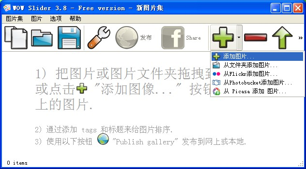
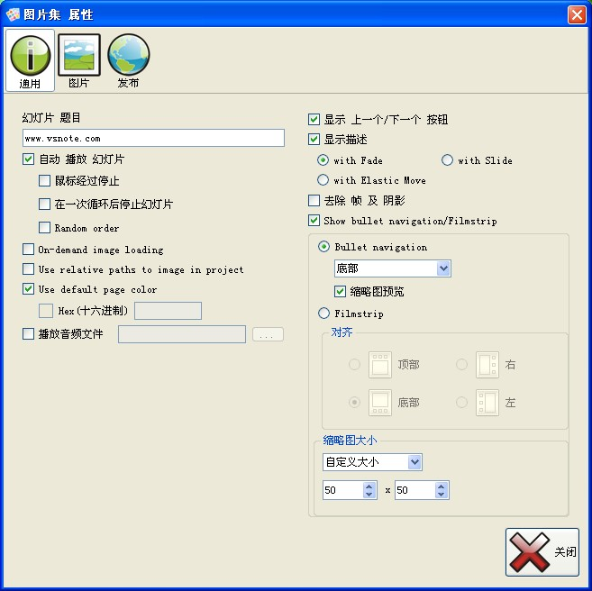
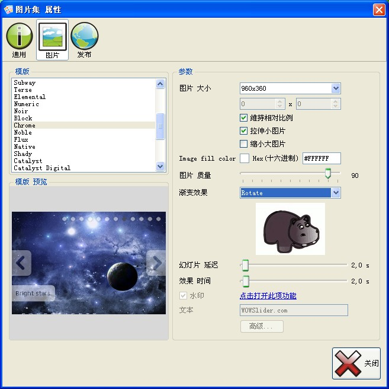
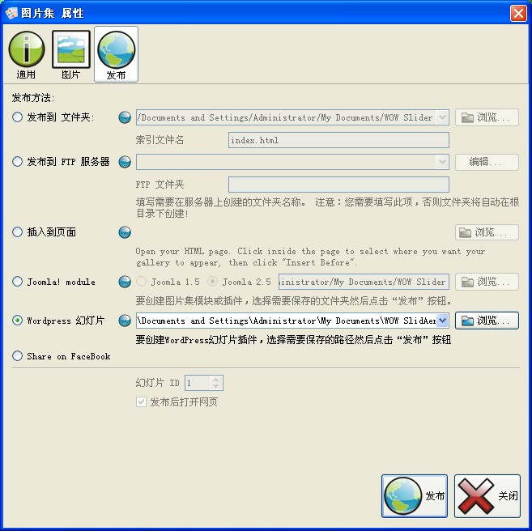

我相信，这是你见过的最简单的制作**JQuery幻灯片**的方法，内置了多个幻灯片模板和多种切换方式，设置完成之后点击发布就能自动生成html在浏览器中预览。  **WOW Slider**拥有“向导”式的助手让你在几秒钟之内创造出效果苦酷炫的幻灯片，完全不需写一行代码。你可以在本地选择图片，当然，也可以通过网络上的一些应用获取(我只有Flickr上面有账户)。图片加好之后点那个大扳手图标进行设置。  设置图片的对齐方式以及文字标题是否显示等。  好了，点击上面的图片选项，开始选择你的模板吧。**WOW Slider** 提供了非常丰富的幻灯片切换模板，还有更多的切换效果。 免费的是有带版权信息的。当然，这个并不是很重要。    点击上面的发布选项，支持发布到本地，以及Wordpress、Joomla!等，以及开始发布你的幻灯片吧。(Wrodpress是以插件的方式保存在本地，要使用的话得上传到你的网站)

#### 下载地址

[官方下载](http://wowslider.com/download/wowslider-win-setup.zip?utm_source=free_downl_win&utm_medium=email&utm_campaign=wow_downl_link) [百度网盘下载](http://pan.baidu.com/share/link?shareid=494723&uk=1796312283)